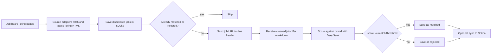

# JobETL

JobETL helps you turn job boards into a short list of jobs that actually fit your CV.

It discovers listings from supported sources, fetches each full offer as markdown, scores it against your resume with AI, and stores the result in a local SQLite database. Optional Notion sync lets the same data flow through GitHub Actions.

## The Idea In 30 Seconds

Simple use case: you want a daily list of jobs worth reviewing instead of opening every offer by hand.

- choose sources and filters
- point the app at your CV in markdown
- run the pipeline
- review only the jobs that passed the match threshold

## Stack

- Runtime: Node.js + TypeScript
- Sources: `justjoin.it`, `nofluffjobs`, `bulldogjob`
- Full-offer extraction: Jina Reader
- AI matching: DeepSeek `deepseek-chat` via the AI SDK
- Storage: local SQLite (`./data/jobetl.db`)
- Optional sync: Notion
- Automation: GitHub Actions

Current code uses DeepSeek for scoring. No OpenAI key is required.

## Flow



## How Jina Reader Works In This Project

Jina Reader is used only for the full job page, not for listing discovery.

1. Each source adapter fetches listing/search pages directly from the job board.
2. The adapter extracts lightweight metadata such as title, company, salary, location, and the job URL.
3. For every job that still needs processing, the app calls `https://r.jina.ai/http://<job-url>` with `JINA_API_KEY`.
4. Jina Reader visits the original job page and returns a cleaned markdown version of the offer.
5. That markdown is sent to DeepSeek together with your CV markdown for scoring.

This means the project does not need a custom detail-page scraper for every source. It only needs source-specific listing discovery plus one shared Jina fetch step for full offers.

## API Keys

Required for the core pipeline:

- `JINA_API_KEY`
- `DEEPSEEK_API_KEY`

Required only if you use Notion sync or the bundled GitHub Actions workflow:

- `NOTION_TOKEN`
- `NOTION_DATABASE_ID`

The same names are used for local env vars and GitHub Actions secrets.

## Quick Setup

Install dependencies:

```bash
npm install
```

Create your local env file and CV file:

```bash
cp .env.example .env
cp cv.example.md cv.md
```

Then:

1. Fill `.env` with your keys.
2. Update `resumeMarkdownPath` in [`src/config.ts`](/home/dandrok/git/jobetl/src/config.ts) to `./cv.md`.
3. Adjust source filters, `matchThreshold`, and concurrency in [`src/config.ts`](/home/dandrok/git/jobetl/src/config.ts).

## Run

Run all enabled sources:

```bash
npm run dev
```

Run a single source:

```bash
npm run dev -- --source justjoinit
npm run dev -- --source nofluffjobs
npm run dev -- --source bulldogjob
```

Review the best saved matches:

```bash
npm run report
```

Optional Notion sync commands:

```bash
npm run import:notion
npm run sync:notion
```

## GitHub Actions

The repo includes [`daily-crawl.yml`](/home/dandrok/git/jobetl/.github/workflows/daily-crawl.yml).

- Trigger: daily schedule plus manual `workflow_dispatch`
- Secrets: `JINA_API_KEY`, `DEEPSEEK_API_KEY`, `NOTION_TOKEN`, `NOTION_DATABASE_ID`
- Workflow order:
  1. `npm run import:notion`
  2. `npm run dev`
  3. `npm run sync:notion`

The current workflow expects Notion to be configured, because GitHub runners start with an empty filesystem and rebuild local SQLite state from Notion before crawling.

## Verify

```bash
npm test
npm run build
```
