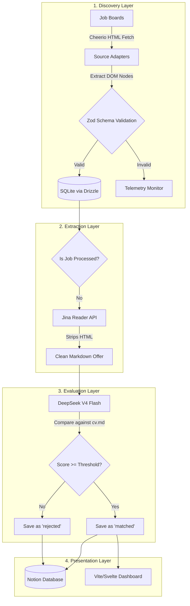

# JobETL

JobETL helps you turn job boards into a short list of jobs that actually fit your CV.

It discovers listings from supported sources, fetches each full offer as markdown, scores it against your resume with AI, and stores the result in a local SQLite database. Optional Notion sync lets the same data flow through GitHub Actions.

## The Idea In 30 Seconds

Simple use case: you want a daily list of jobs worth reviewing instead of opening every offer by hand.

- choose sources and filters
- point the app at your CV in markdown
- run the pipeline
- review only the jobs that passed the match threshold

## Stack

- Runtime: Node.js + TypeScript
- Sources: `justjoin.it`, `nofluffjobs`, `bulldogjob`, `pracuj.pl`
- Full-offer extraction: Jina Reader
- AI matching: DeepSeek `deepseek-v4-flash` via the AI SDK
- Storage: local SQLite (`./data/jobetl.db`) managed via **Drizzle ORM**
- UI: Svelte 5 + Vite
- Optional sync: Notion
- Automation: GitHub Actions

Current code uses DeepSeek for scoring. No OpenAI key is required.

## How It Works (The Architecture)

JobETL is designed to be fast, resilient, and cheap to run. Instead of building monolithic, brittle scrapers for every job board, the pipeline is split into four distinct layers:

### 1. Discovery & Validation (Cheerio + Zod)
First, we need to find the job links fast.
- **Cheerio** is used to rapidly download and parse the HTML search result pages. It is extremely fast and lightweight.
- **Zod** acts as our structural firewall. Because job boards frequently change their DOM (HTML structure), scrapers break often. Every extracted job listing is immediately passed through a strict Zod schema (`JobListingSchema`). If a job board changes its layout and our scraper misses a title or company, Zod catches it instantly and logs it via our Telemetry system instead of silently corrupting the database.

### 2. Deep Extraction (Jina Reader)
Once we have a valid list of job URLs, we need the actual job descriptions.
- **Jina Reader API** (`https://r.jina.ai/`) acts as our universal extractor. 
- **Why Jina?** We wanted to avoid writing and maintaining 4 separate, heavy, Puppeteer/Playwright scripts just to read the details of an offer. Jina visits the URL for us, bypasses anti-bot protections, strips out all the noisy HTML (ads, navbars, popups), and returns pure, clean Markdown. 

### 3. Intelligence (DeepSeek V4)
With the clean Markdown in hand, we evaluate the job.
- **DeepSeek V4 (`deepseek-v4-flash`)** is used via the Vercel AI SDK to score the job's Markdown against your personal `cv.md`. 
- **Why DeepSeek?** It provides near GPT-4 level intelligence at a fraction of the cost and extreme speed, making it perfect for bulk-scoring hundreds of job listings every day without breaking the bank.

### 4. Storage (SQLite + Drizzle ORM)
Everything is saved locally so we don't re-process or re-score the same jobs tomorrow.
- **SQLite** is the local database (`./data/jobetl.db`).
- **Drizzle ORM** manages the schema and queries. We chose Drizzle because it provides 100% strict TypeScript safety for our SQL queries, eliminating runtime bugs and making the database logic extremely easy to refactor without heavy boilerplate.

---

## The Pipeline Flow


```mermaid
flowchart TD
    subgraph Discovery [1. Discovery Layer]
        A[Job Boards] -->|Cheerio HTML Fetch| B[Source Adapters]
        B -->|Extract DOM Nodes| C{Zod Schema Validation}
        C -->|Valid| D[(SQLite via Drizzle)]
        C -->|Invalid| E[Telemetry Monitor]
    end

    subgraph Extraction [2. Extraction Layer]
        D --> F{Is Job Processed?}
        F -->|No| G[Jina Reader API]
        G -->|Strips HTML| H[Clean Markdown Offer]
    end

    subgraph Intelligence [3. Evaluation Layer]
        H --> I[DeepSeek V4 Flash]
        I -->|Compare against cv.md| J{Score >= Threshold?}
        J -->|Yes| K[Save as 'matched']
        J -->|No| L[Save as 'rejected']
    end

    subgraph Integration [4. Presentation Layer]
        K --> M[(Notion Database)]
        L --> M
        K --> N[Vite/Svelte Dashboard]
    end
```

## API Keys

Required for the core pipeline:

- `JINA_API_KEY`
- `DEEPSEEK_API_KEY`

Required only if you use Notion sync or the bundled GitHub Actions workflow:

- `NOTION_TOKEN`
- `NOTION_DATABASE_ID`

The same names are used for local env vars and GitHub Actions secrets.

## Quick Setup

Install dependencies:

```bash
npm install
```

Create your local env file and CV file:

```bash
cp .env.example .env
cp cv.example.md cv.md
```

Then:

1. Fill `.env` with your keys.
2. Update `resumeMarkdownPath` in [`src/config.ts`](/home/dandrok/git/jobetl/src/config.ts) to `./cv.md`.
3. Adjust source filters, `matchThreshold`, and concurrency in [`src/config.ts`](/home/dandrok/git/jobetl/src/config.ts).

## Run

Run all enabled sources:

```bash
npm run dev
```

Run a single source:

```bash
npm run dev -- --source justjoinit
npm run dev -- --source nofluffjobs
npm run dev -- --source bulldogjob
npm run dev -- --source pracujpl
```

Review the best saved matches in the terminal:

```bash
npm run report
```

Launch the interactive Svelte Web Dashboard:

```bash
npm run dev:ui
```

Optional Notion sync commands:

```bash
npm run import:notion
npm run sync:notion
```

## GitHub Actions

The repo includes two core workflows:

1. [`daily-crawl.yml`](/home/dandrok/git/jobetl/.github/workflows/daily-crawl.yml): Production ETL cron job.
   - Trigger: daily schedule plus manual `workflow_dispatch`
   - Secrets: `JINA_API_KEY`, `DEEPSEEK_API_KEY`, `NOTION_TOKEN`, `NOTION_DATABASE_ID`
   - Expectations: Expects Notion to be configured since it rebuilds local SQLite state from Notion before crawling.
2. [`ci.yml`](/home/dandrok/git/jobetl/.github/workflows/ci.yml): Continuous Integration.
   - Trigger: `push` and `pull_request` to `master`.
   - Pipeline: Enforces Prettier formatting, ESLint rules, TypeScript compilation, and Vitest suite execution.

## Verify & Format

Before pushing changes, ensure your code passes the CI checks locally:

```bash
npm run format
npm run lint
npm test
npm run build
```
