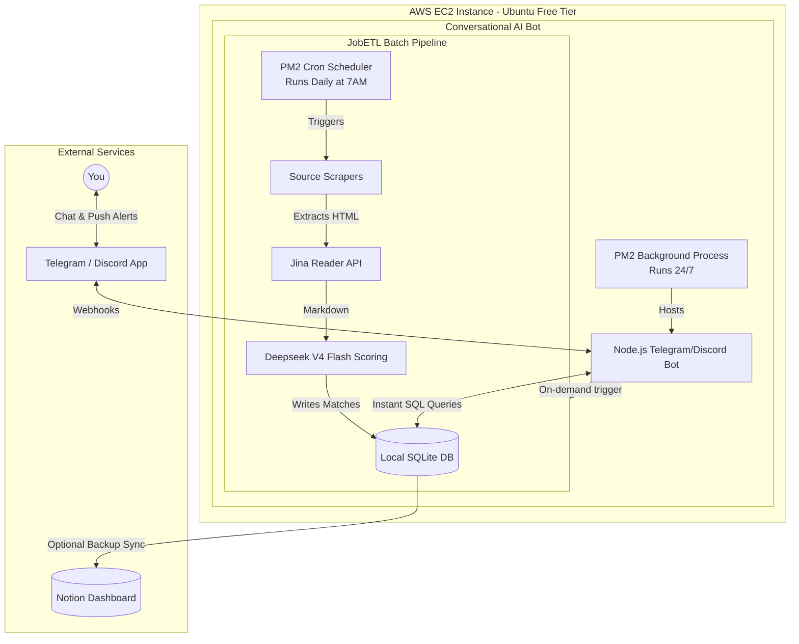

# JobETL - TODOs

## High Priority
- [x] **Fix `JustJoinIt` Scraper Adapter:** *Fixed.* Successfully reverse-engineered the DOM structure to extract data from the sibling containers instead of the empty overlay anchor tags.

## DevOps / Infrastructure
- [x] **Automated ETL Pipeline:** *Already implemented.* The system uses `.github/workflows/daily-crawl.yml` to automatically scrape, score, and sync with the Notion database.

## Optimizations & Documentation
- [x] **Pipeline Optimization:** *Fixed.* Increased `scoreConcurrency` from 2 to 10 in `src/config.ts` to allow 5x faster parallel execution of LLM scoring tasks.
- [x] **Documentation Flowchart:** *Fixed.* Redesigned the Mermaid diagram in `README.md` from a simple left-to-right (`LR`) sequence to a top-down (`TD`) architecture overview with logical subgraphs.

## Manual Setup Tasks
- [ ] **Configure `CV_MARKDOWN` Secret:** The GitHub Actions pipeline now dynamically creates `cv.md` via secrets (since it's gitignored). You need to manually go to **GitHub Settings > Secrets and variables > Actions**, create a new secret named `CV_MARKDOWN`, and paste the full contents of your local `cv.md` inside it.

## Features
- [x] **CV Sent / Applied Tracking:** Added a boolean flag `is_applied` (default `false`) to the local SQLite database to track if a CV was sent for a job offer. This flag is seamlessly synced bidirectionally with the Notion dashboard ("Applied" checkbox) and can be toggled directly from the local UI viewer.

## Phase 2: AWS Conversational Agent Architecture
This is the planned migration from a stateless GitHub Action to a stateful, 24/7 AWS EC2 instance running a conversational bot (Telegram/Discord) alongside the ETL pipeline. By centralizing it on AWS, the Bot and the Cron job can share the exact same local SQLite database, resulting in a lightning-fast, zero-latency personal assistant.

## Future Architectural Improvements

### 1. Frontend Architecture: Componentization
- [ ] **Migrate Dashboard:** The current `src/dashboard.html` is a fragile ~1,000-line monolith relying on manual DOM manipulation. Migrate to a modern build system (e.g., Vite + Preact or Svelte) to enforce strict component boundaries, reactive state management, and easier styling maintenance.

### 2. Scraper Resilience & Telemetry
- [ ] **Data Validation Layer:** Implement **Zod** schemas at the scraper boundary. If structural changes occur on external portals (e.g., class name changes on `justjoin.it`), the pipeline should throw structured errors instead of silently failing or persisting corrupted data.
- [ ] **Failure Telemetry:** Add webhook alerts (Discord/Slack) triggered by extraction failure rate spikes to self-monitor scraper health.

### 3. Database Layer: Formal Schema Migrations
- [ ] **Introduce an ORM:** Raw `PRAGMA` checks for schema modifications are an unsustainable stopgap. Integrate a type-safe Query Builder/ORM like **Drizzle ORM** or **Kysely**. This ensures that the TypeScript `StoredJob` types map perfectly to the database schema and enables automated, trackable database migrations.

### 4. LLM Scoring: Contextual RAG
- [ ] **Dynamic Embedding Retrieval:** `DeepSeekMatcher` currently scores against a static Markdown CV zero-shot. Implement **RAG (Retrieval-Augmented Generation)** using an embedded vector database (like Chroma or SQLite `vss`). By injecting past binary decisions (`isApplied: true/false`) into the LLM context, the model will dynamically learn implicit preferences, drastically improving signal-to-noise ratio.
